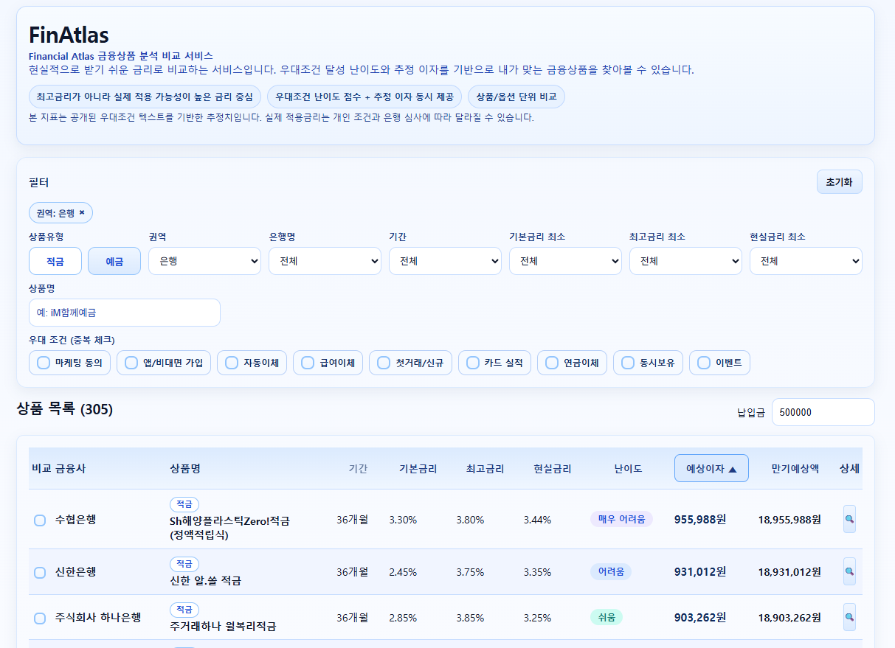

# FinAtlas
- [🔗FinAtlas - 금융 상품(예적금) 비교 분석 서비스](https://hyeonseo2.github.io/FinAtlas/)
**금융 상품의 ‘복잡한 우대 조건’을 정리해, 내 상황에 맞는 저축/예금 상품을 빠르게 비교하는 금융상품 비교 분석 서비스**



## 핵심 기능
- **상품 비교 분석**: 기간, 기본금리, 최고금리, 현실금리, 난이도 기준으로 상품을 비교
- **조건 반영 계산 시뮬레이션**: 입력한 납입금 기준으로 예상이자와 만기 예상액을 계산해 실사용 관점에서 비교
- **예금/적금 실전 계산 분기**: 예금은 일시납입 방식, 적금은 월납입 방식으로 계산 결과를 분리 반영
- **우대조건 가시화**: 공표된 우대조건을 해석 가능한 조건/추가 확인이 필요한 조건으로 구분 표시
- **직관적 상세 뷰**: 상품별 핵심 지표(기본/최고/현실금리, 난이도, 우대조건 수)와 기간별 옵션 비교를 한 화면에 제공
- **상품 비교 모아보기**: 최대 4개 상품을 동시에 비교해 현실금리·난이도·예상이자·만기예상액을 비교

## 사용 영역
- 금융상품 비교/분석
- 우대조건 달성 가능성 기반 의사결정 보조
- 만기/수익성 예측 기반 상품 선별

## 기술 스택
- Python (requests)
- React + TypeScript + Vite

## 실행

### 파이프라인
```bash
cd /home/g0525yhs/finatlas
export FINLIFE_API_KEY=...
python scripts/run_pipeline.py
```

### 프론트엔드
```bash
cd /home/g0525yhs/finatlas/frontend
npm install
npm run dev
```

### 빌드/테스트
```bash
cd /home/g0525yhs/finatlas/frontend
npm run build
cd /home/g0525yhs/finatlas
pytest -q
```

## 배포 정책
- GitHub Actions: 데이터 갱신(`update-data.yml`) / GitHub Pages 정적 배포(`pages.yml`) 지원
